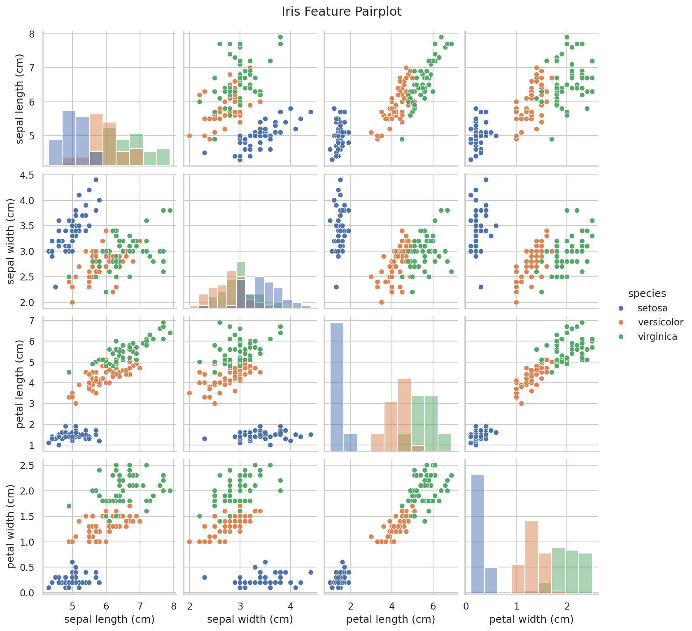
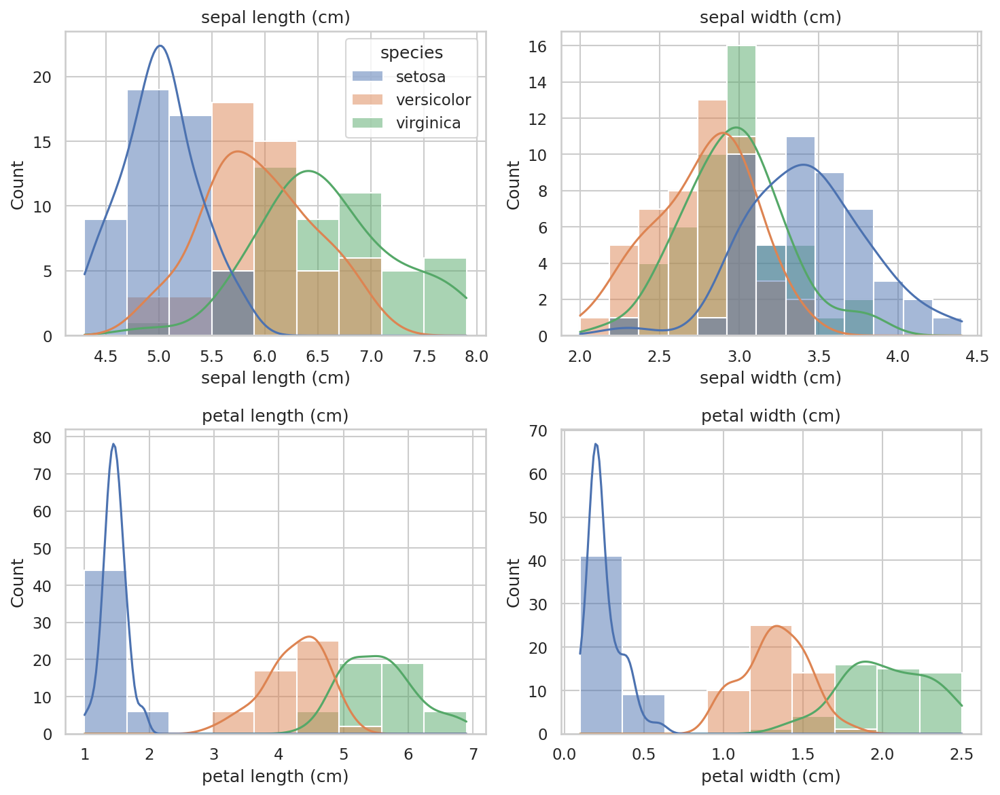
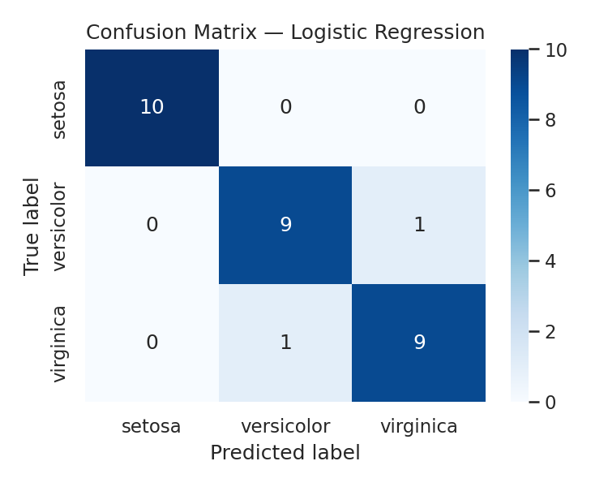
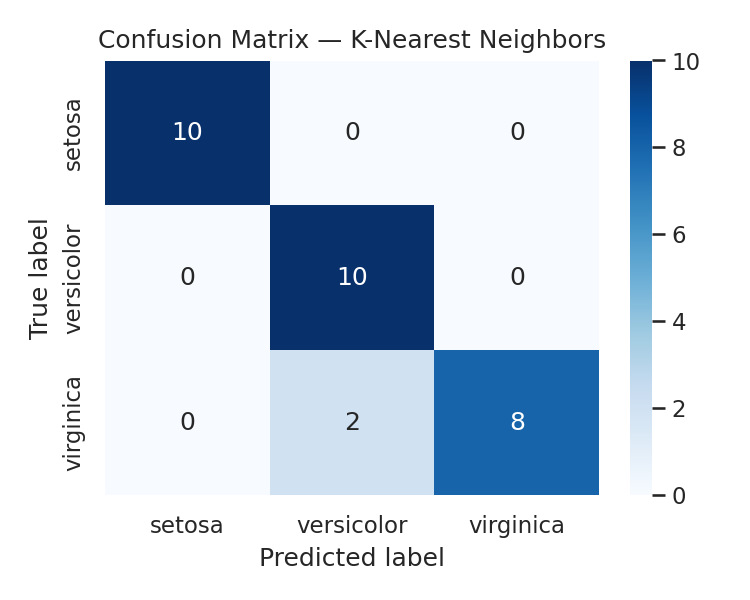

# Iris Flower Classification

A machine learning project that classifies Iris flowers into three species: Setosa, Versicolor, and Virginica.

## Dataset

The Iris dataset is loaded using Scikit-learn's built-in dataset.

- 150 samples
- 4 features
- 3 classes

## Technologies

- Python
- Pandas
- NumPy
- Matplotlib
- Seaborn
- Scikit-learn

## Models Used

1. Logistic Regression
2. K-Nearest Neighbors
3. Decision Tree

## Model Performance

| Model | Accuracy | Precision | Recall | F1 Score |
|---|---:|---:|---:|---:|
| Logistic Regression | 0.933333 | 0.933333 | 0.933333 | 0.933333 |
| K-Nearest Neighbors | 0.933333 | 0.944444 | 0.933333 | 0.932660 |
| Decision Tree | 0.933333 | 0.933333 | 0.933333 | 0.933333 |

## Visualizations

### Iris Pairplot



### Feature Histograms



### Logistic Regression Confusion Matrix



### K-Nearest Neighbors Confusion Matrix



### Decision Tree Confusion Matrix


## How to Run

Install the required libraries:

```bash
pip install -r requirements.txt
